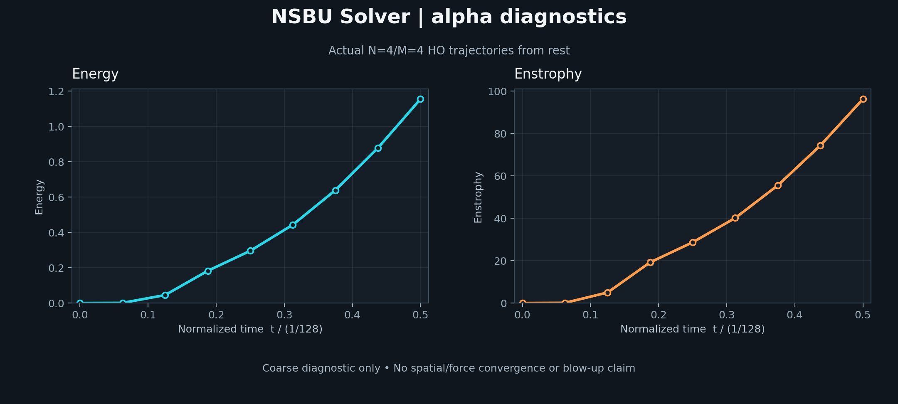

# NSBU Solver

A standalone Rust project for incompressible, three-dimensional Navier–Stokes simulation and carefully qualified concentrating-flow experiments.



*Actual coarse N=4/M=4 HO diagnostic measurements. A successful finite run is a runtime check, not evidence of convergence or blow-up.*

**Status: [runtime alpha released](https://github.com/nivatechnologies/nsbu-solver/releases/tag/alpha-20260912); zero accepted PDE convergence windows.** The Rust library and CLI run bounded smooth and exact-v2 CM/HO trajectories from rest, including checkpoint/resume. Local and hosted runtime/quality gates pass, and the downloaded binary is verified. Scientific qualification continues. See the [runtime guide](docs/RUNTIME_ALPHA.md) and [latest release evidence](evidence/runtime-alpha/alpha-20260912/README.md).

The `main` branch can contain experimental APIs added after the latest binary
release. Each increment records its own validation scope in
[project status](project-status.json). Release binaries require both hosted
workflows to pass on their exact source revision.

The library implements spectral operators, CM/HO integration, exact-v2 forcing, bounded transactional attempts, and independent diagnostics. The CLI provides bounded smooth and v2/resume-v2 commands; all external resumes retain an unverified origin. This checkout also preserves the reviewed specification, benchmark manifest, mathematical checks, and active implementation plan.

The NSBU Solver library evolves all three velocity components on a periodic three-dimensional domain, with fixed positive viscosity and a prescribed force:

```text
partial_t u + (u dot grad)u = -grad p + nu Laplacian(u) + f(x,t)
div u = 0,  nu > 0
```

The library uses Fourier pseudospectral discretization, 3/2 padding for quadratic products, incompressibility projection, and exponential Runge–Kutta integration. Bounded attempts, the exact integer tick clock, transactional state commits, and resource preflight are implemented. Complete same-profile runtime checkpoint/resume is implemented for smooth and exact-v2 diagnostics. Scientific checkpoint provenance and the concentrating window-convergence verifier remain in progress.

## What the first experiment means

The first concentrating case is **`similarity-mms-v2`**, a manufactured prescribed-force problem for a viscous fluid in a periodic three-dimensional box. Each CM or HO comparison trajectory starts from rest and advances its own velocity state. The known analytical field is used afterward to measure error; it is never injected into the numerical state and never resets the trajectory.

This lets computational physicists inspect how a Fourier pseudospectral solver responds to a prescribed, increasingly concentrated target while varying the velocity grid, force sampling, time step, arithmetic, and integrator independently. The current N=4/M=4 measurements are deliberately coarse. They show that a bounded run completes and expose large errors; they do not establish convergence, resolve a singular limit, or prove finite-time blow-up. No concentrating PDE window has been accepted. Literal reproduction of the manuscript's pulse cascade is excluded from this alpha.

## Research context and limits

Navier–Stokes describes how a fluid accelerates under pressure, viscosity and external forces. It treats the fluid as a continuous medium. A mathematical blow-up means a quantity becomes unbounded in finite time; it is a question about the equations, not a prediction that a cup of water becomes a physical singularity. A finite computer grid cannot follow arbitrarily small scales.

[OpenAI reports](https://openai.com/index/navier-stokes-solution/) an analytical proof and Lean formalization of forced Navier–Stokes breakdown from rest with finite energy and a smooth force, corresponding to Clay statements C and D; it separately reports an unforced Euler result. The supplied [Navier–Stokes manuscript](https://cdn.openai.com/pdf/32d9f210-8b73-45e0-91bc-82a30aef8a9a/navier-stokes.pdf) describes an annular background and oscillatory pulses. NSBU does not independently audit that proof, and this project does not assert that the prize is settled.

The [official Clay problem statement](https://www.claymath.org/wp-content/uploads/2022/06/navierstokes.pdf) permits either global existence and smoothness or breakdown. Its existence formulations A and B are unforced. Its breakdown formulations C and D permit forcing only when the stated smoothness and decay conditions hold globally; an arbitrary force is not enough. NSBU has not proved that `similarity-mms-v2` extends with those properties through its target time.

The separate [Euler blow-up visualization repository](https://github.com/pmocz/euler-blowup-viz) presents an Euler construction through WKB and reduced-dynamics visualizations and says the full cascade is beyond direct simulation. NSBU instead integrates viscous PDE trajectories for a different manufactured case and reports numerical diagnostics. It neither resolves that cascade nor supplies a stronger proof.

The explicit slow-mesh strategy is `FeasibilityExcluded` under the documented resource policy. Feasibility across unspecified representations remains `FeasibilityUnestablished`. The optional construction compiler is limited to mathematics verification; an averaged-stress surrogate remains a separate, deferred model. See the [scientific scope](docs/SCIENTIFIC_SCOPE.md).

## Download and run the alpha

The [alpha-20260911-2 prerelease](https://github.com/nivatechnologies/nsbu-solver/releases/tag/alpha-20260912)
provides the tested Linux x86_64 GNU/glibc binary. Download the archive and
its detached checksum, verify both the archive and its extracted contents,
then run the bounded diagnostic:

```sh
curl -fLO https://github.com/nivatechnologies/nsbu-solver/releases/download/alpha-20260911-2/nsbu-solver-alpha-20260911-2-x86_64-unknown-linux-gnu.tar.gz
curl -fLO https://github.com/nivatechnologies/nsbu-solver/releases/download/alpha-20260911-2/nsbu-solver-alpha-20260911-2-x86_64-unknown-linux-gnu.tar.gz.sha256
sha256sum -c nsbu-solver-alpha-20260911-2-x86_64-unknown-linux-gnu.tar.gz.sha256
tar -xzf nsbu-solver-alpha-20260911-2-x86_64-unknown-linux-gnu.tar.gz
cd nsbu-solver-alpha-20260911-2-x86_64-unknown-linux-gnu
sha256sum -c SHA256SUMS
./bin/nsbu v2 --dry-run
./bin/nsbu v2
./bin/nsbu diagnose-v2 --dry-run
./bin/nsbu diagnose-v2
```

This artifact targets Linux x86_64 with GNU/glibc and requires GLIBC symbols
up to 2.35; inspect `SOURCE-MANIFEST.txt` for the recorded requirements.
Other platforms require a source build. The alpha is diagnostic-only, with
zero accepted PDE convergence windows; it provides no proof of finite-time
blow-up.

## Refinement diagnostics

The published alpha includes a fixed, reproducible diagnostic family:

```sh
./bin/nsbu diagnose-v2 --dry-run
./bin/nsbu diagnose-v2
```

To build the current CLI from source instead, run these commands from the repository
root:

```sh
cargo build --release --locked -p nsbu-cli
./target/release/nsbu diagnose-v2 --dry-run
./target/release/nsbu diagnose-v2
./target/release/nsbu v2 --cache-force --dry-run
./target/release/nsbu v2 --cache-force
```

The cache and reconstructed-probe export are current-source capabilities; they
are not included in the downloaded `alpha-20260911-2` binary. The library's
`DiagnosticExportPlan::new_v2` exposes the full integrated export; `diagnose-v2`
emits bounded CLI summaries. Cached v2 runs do
not support checkpoint writes or `resume-v2`; use the default path for
checkpoint workflows. The [paired cache timing evidence](evidence/p09/v2-cli-cache-timing/README.md)
is a tiny shared-host study, not a general performance claim.

It independently evolves space, time-step, and CM/HO comparison trajectories
on grids 4/8/12 through a short startup interval. JSON lines identify the case,
branch profiles, exact clocks, resource reservations, separate physical
quantities, pressure, reference tracking, and off-step residual summaries.
The full reconstructed-probe path measures off-stage physical reports through
the library export; the CLI does not emit that full export. Off-stage analytical
reference tracking remains unavailable. See the [reconstructed physical
integration evidence](evidence/p09/v2-probe-physical-integration/README.md).
Allow roughly one to two minutes on the measured host; runtime varies. Every
report remains `UnqualifiedDiagnostic` and lists missing qualification
channels. See the [diagnostic guide](docs/V2_DIAGNOSTIC_COORDINATOR.md) for
the complete library reports and interpretation.

## Python verification checks

Python 3.12 and the development dependencies below are for repository and
mathematical design verification. Python is not the runtime for the alpha
binary, and Rust is not required to run these checks.

```sh
git clone https://github.com/nivatechnologies/nsbu-solver.git
cd nsbu-solver
python3 -m venv .venv
. .venv/bin/activate
python -m pip install -r requirements-dev.txt
python tools/check_repository.py
python -m unittest discover -s tools/tests -v
python tools/verify_design.py --output work/design-checks.json
```

When using the complete source ZIP, extract it with its directory structure intact and start from the extracted `nsbu-solver` directory, omitting the clone command. The archive includes hidden paths such as `.github/workflows/checks.yml`, `.gitignore` and `.gitattributes`; selecting only visible files can omit required bootstrap inputs.

The repository check verifies the frozen inputs, mathematical problem identity, local documentation links, and public-package boundaries. The unit tests exercise missing-file, modified-input and unsafe-output failures. The design runner reruns selected algebra, coefficient, clock, geometry, resource, and source-screening checks and compares their report with the preserved evidence before adding execution metadata. Its `status: passed` means those checks passed; it does not mean a PDE simulation passed.

See [installation](docs/INSTALL.md) for setup, [runtime alpha](docs/RUNTIME_ALPHA.md) for the v2 profile, and [usage](docs/USAGE.md) for report interpretation. The Rust workspace builds with Rust 1.94.0. Every command performs bounded admission and reports diagnostic status; none qualifies the concentrating benchmark.

The [independent Python reference](reference/README.md) now provides pointwise v2
scalar/jet evaluations, direct-DFT fixtures, and N=4 smooth trajectories evolved
from rest with temporal and 80/120-digit arithmetic refinements. P00B and its Python quality gates pass. The [coarse concentrating diagnostic](evidence/p00c/README.md) also reaches the first endpoint
from rest with both methods, with large tracking errors and unresolved spatial
sampling. No qualified concentrating PDE trajectory is established. The Rust
[benchmark library](crates/nsbu-benchmarks/README.md) now provides independent v2
scalar/jet evaluations and a bounded sampled force provider; its final package
verification passed locally and in hosted CI. The [first Rust concentrating diagnostic](evidence/p06/README.md)
has also reached 1/256 from rest on N=4, with spatial/force resolution unresolved.

## Implementation status

| Area | Status | Evidence or remaining work |
|---|---|---|
| Rust numerical core | Implemented | Periodic domains, FFT operators, 3/2-padded products, projection, pressure, and bounded CM/HO integration |
| Manufactured benchmark | Implemented | Independent exact-v2 force evaluation and from-rest `similarity-mms-v2` trajectories |
| Runtime safeguards | Implemented | Exact tick clocks, resource preflight, transactional commits, and same-profile checkpoint/resume |
| Independent checks | Implemented | Python direct-DFT fixtures, high-precision comparisons, restart checks, and full-band diagnostics |
| Diagnostic families on `main` | Implemented | Independent space/time/method and force-grid families; pressure, regional tracking, off-step residuals, balance quadrature, and nested physical sampling |
| Fixed diagnostic artifacts | Implemented, unqualified | [Full seven-event JSON export](docs/V2_DIAGNOSTIC_EXPORT.md) and [four-observable partial review extraction](docs/V2_PARTIAL_REVIEW.md); neither supplies complete provenance, a full review, or a PDE window |
| [Concentrating PDE qualification](docs/NEXT_CONCENTRATING_WINDOW.md) | Pending | Zero accepted windows; space, time, force-sampling, arithmetic, pressure, balance, and residual criteria remain open |
| Scientific checkpoint provenance | Pending | Imported checkpoint origins remain unverified until lineage requirements are complete |
| Literal manuscript cascade | Excluded from this alpha | The runtime does not reproduce the annular pulse construction |

### TODO

- [ ] Establish the first accepted concentrating PDE window with independent space, time, force-sampling, and arithmetic refinements.
- [ ] Connect the implemented diagnostics to the full frozen observable/channel review; complete pressure-reference, gauge, region-coverage, and current-grid arithmetic evidence.
- [ ] Complete scientific checkpoint provenance and lineage verification.
- [ ] Optimize the force evaluation and larger-grid runs while retaining independent accuracy checks.
- [ ] Add the planned visualization tools after solver validation.

The [implementation plan](IMPLEMENTATION_PLAN.md) supplies dependencies, concrete work packages, stop conditions, and release gates. We are actively looking for contributors in numerical methods, Rust, independent verification, performance, documentation and scientific visualization. See [CONTRIBUTING.md](CONTRIBUTING.md) to get started. A generic runtime release and a qualified concentrating-results release have separate evidence requirements.

## Resources

These values are conservative design reservations, excluding FFT plans, provider scratch, diagnostic grids, I/O, and allocator overhead. They are not measured usage or convergence results.

| Grid | Base reservation | Maximum endpoint index under the 12-cells-per-peak-radius screen |
|---|---:|---:|
| `128^3` | 1.25336 GiB | 0 |
| `256^3` | 9.98218 GiB | 1 |
| `512^3` | 79.67871 GiB | 3 |
| `1024^3` | 636.71484 GiB | 5 |

Here `t_k = T_star * (1 - 2^(-k))`, with `T_star = 1/128`. The screen is a heuristic, not an acceptance test. Coarser comparison branches can reduce the qualified frontier. A `128^3` run would be a diagnostic pilot under this policy.

## Project documents

| Document | Purpose |
|---|---|
| [Implementation plan](IMPLEMENTATION_PLAN.md) | Active NSBU work sequence and release criteria |
| [Complete numerical design](docs/design/COMPLETE_DESIGN.md) | Frozen revision 0.7 engineering baseline |
| [Benchmark manifest](benchmarks/similarity-mms-v2.json) | Exact rational inputs and mathematical problem identity |
| [Scientific scope](docs/SCIENTIFIC_SCOPE.md) | Meaning and limits of results |
| [Provenance and adopted decisions](docs/PROVENANCE.md) | Historical naming, baseline hashes, licensing overlay |
| [Architecture](docs/ARCHITECTURE.md) | Module responsibilities, ownership and transaction flow |
| [Smooth experiment walkthrough](docs/EXPERIMENTS.md) | Six independent trajectories, off-stage reconstruction and PDE residual samples |
| [Exact-v2 refinement families](docs/V2_REFINEMENTS.md) | Independent space/time/method trajectories with fixed force sampling and complete Fourier comparisons |
| [Exact-v2 diagnostic coordinator](docs/V2_DIAGNOSTIC_COORDINATOR.md) | Bounded accepted-state and off-step reports from two independent six-branch families |
| [Exact-v2 nested sampling](docs/V2_SAMPLING.md) | Held-fixed states on three nested sample lattices, with separate RMS/peak measurements and peak locations |
| [Exact-v2 residuals](docs/V2_RESIDUALS.md) | Fresh-force doubled-band momentum defects at genuine non-stage clocks |
| [Exact-v2 balance quadrature](docs/V2_BALANCE_QUADRATURE.md) | Six reconstructed balance streams and three nested Simpson schedules |
| [Exact-v2 force refinements](docs/V2_FORCE_REFINEMENTS.md) | Independent trajectories varying force sampling at fixed velocity grid and time step |
| [Exact-v2 analytical tracking](docs/V2_REFERENCE_TRACKING.md) | Sampled velocity, gradient, Hessian and vorticity errors against the analytical reference |
| [Exact-v2 accepted-node reconstruction](docs/V2_RECONSTRUCTION.md) | Separate bounded owner retaining integrated endpoint values and independently evaluated derivatives |
| [Exact-v2 off-stage probes](docs/V2_PROBES.md) | Six independent reconstructed trajectories, exact lookahead and complete value/derivative comparisons |
| [Exact-v2 regional tracking](docs/V2_REGIONAL_TRACKING.md) | Global and regional sampled errors with explicit missing-class results |
| [Parallel force sampling](docs/PARALLEL_FORCE.md) | Persistent worker ownership, exact coefficient comparisons and resource limits |
| [Force evaluation](docs/FORCE_EVALUATION.md) | Exact-v2 axial root reuse, bounded resources and coefficient-preservation checks |
| [Reduced-coordinate force values](docs/REDUCED_FORCE.md) | Optional pointwise evaluator, independent high-precision fixtures and measured limits |
| [Arithmetic study](docs/ARITHMETIC_STUDY.md) | Same-grid Rust/direct-DFT comparisons with separate prescribed-force effects |
| [Derived-field arithmetic](docs/DERIVED_ARITHMETIC.md) | Complete velocity tensors, vorticity and physical pressure compared at 80/120 digits |
| [Physical-reduction arithmetic](docs/REDUCTION_ARITHMETIC.md) | Production tensor statistics compared with independent 80/120-digit exact-word reductions |
| [Numerical conventions](docs/NUMERICAL_CONVENTIONS.md) | Fourier, pressure, norms and exact-time contracts |
| [Checkpoint formats](docs/CHECKPOINT_FORMAT.md) | Experimental byte formats, caps and import-origin boundaries |
| [Numerical protocol identity](docs/PROTOCOL_FORMAT.md) | Canonical tolerance rules, exact tested times and reconstruction geometry |
| [Physical derivative diagnostics](docs/DERIVATIVE_DIAGNOSTICS.md) | Full-band scalar derivatives, v2 reference tensors and regional errors |
| [Physical-field comparisons](docs/PHYSICAL_COMPARISONS.md) | Complete scalar/vector/tensor comparisons and v2 regional aggregation |
| [Physical refinement families](docs/PHYSICAL_REFINEMENTS.md) | Actual six-trajectory comparisons, exact clocks and finite diagnostic budgets |
| [Reference pressure gauge](docs/PRESSURE_REFERENCE.md) | Exact-v2 global mean with independent bounded quadrature/arithmetic refinements |
| [Pressure refinements](docs/PRESSURE_REFINEMENTS.md) | Independent full-band physical pressure from actual accepted states |
| [Sampling refinements](docs/SAMPLING_REFINEMENTS.md) | Three physical sample grids, complete tensors/pressure and preserved peak sensitivity |
| [Accepted-history probes](docs/RECONSTRUCTED_PROBES.md) | Stream early and late reconstruction samples with exact node origins and bounded lookahead |
| [Reconstructed physical fields](docs/RECONSTRUCTED_PHYSICAL_FIELDS.md) | Complete tensors/pressure at exact probe times with retained accepted-node origins |
| [Balance quadrature](docs/BALANCE_QUADRATURE.md) | Independently refined physical-time balance integration over unchanged reconstructed trajectories |
| [Streamed residuals](docs/STREAMED_RESIDUALS.md) | Full independent defects and actual nested histories at early and late non-stage times |
| [Resources and errors](docs/RESOURCES_AND_ERRORS.md) | Complete reservations, bounded work and failure handling |
| [Contributing](CONTRIBUTING.md) | Development and evidence requirements |

## License

Original project material is licensed under the [Apache License, Version 2.0](LICENSE). See [NOTICE](NOTICE) and [third-party provenance](THIRD_PARTY.md). Cited papers and external repositories retain their own terms; this repository does not import or relicense them.
